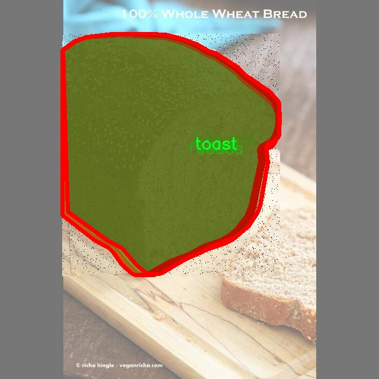

# 面包种类图像分割系统源码＆数据集分享
 [yolov8-seg-GhostHGNetV2＆yolov8-seg-C2f-DCNV3等50+全套改进创新点发刊_一键训练教程_Web前端展示]

### 1.研究背景与意义

项目参考[ILSVRC ImageNet Large Scale Visual Recognition Challenge](https://gitee.com/YOLOv8_YOLOv11_Segmentation_Studio/projects)

项目来源[AAAI Global Al lnnovation Contest](https://kdocs.cn/l/cszuIiCKVNis)

研究背景与意义

随着食品工业的快速发展，面包作为一种广泛消费的食品，其种类和品质的多样性日益增加。不同种类的面包不仅在外观上存在显著差异，而且在营养成分、口感和烹饪方式上也各具特色。因此，准确识别和分类面包种类，对于提升食品生产的自动化水平、优化供应链管理、保障食品安全等方面具有重要意义。然而，传统的面包分类方法往往依赖人工识别，不仅效率低下，而且容易受到人为因素的影响，导致分类结果的不一致性和不准确性。因此，基于计算机视觉技术的自动化面包种类识别与分割系统应运而生。

在众多计算机视觉算法中，YOLO（You Only Look Once）系列模型因其高效的实时检测能力而备受关注。YOLOv8作为该系列的最新版本，结合了深度学习和卷积神经网络的优势，具备了更强的特征提取能力和更快的处理速度。然而，尽管YOLOv8在目标检测领域表现出色，但在复杂背景下的图像分割任务中仍然存在一定的局限性。为了克服这些不足，改进YOLOv8模型以适应面包种类的图像分割任务显得尤为重要。

本研究将基于一个包含1200张图像和17种面包类别的数据集，构建一个改进的YOLOv8面包种类图像分割系统。该数据集涵盖了多种面包类型，包括法棍、黑面包、圆面包、吐司等，涵盖了不同的烹饪状态（如生、熟、烧焦等）和外观特征（如有无种子、形状等）。通过对这些图像进行深度学习训练，系统将能够自动识别和分割不同种类的面包，为食品行业提供高效、准确的分类解决方案。

研究的意义不仅在于提升面包种类识别的准确性和效率，更在于推动计算机视觉技术在食品行业的应用。通过实现面包种类的自动化识别与分割，可以为生产线上的质量控制提供实时反馈，帮助企业快速调整生产策略，减少资源浪费。此外，该系统还可以应用于智能零售、食品配送等场景，提高消费者的购物体验和满意度。

综上所述，基于改进YOLOv8的面包种类图像分割系统的研究，不仅具有重要的理论价值，也具备广泛的实际应用前景。通过本研究的实施，将为面包生产和销售领域带来新的技术突破，推动食品行业的智能化发展，促进食品安全和质量的提升。

### 2.图片演示


##### 注意：由于此博客编辑较早，上面“2.图片演示”和“3.视频演示”展示的系统图片或者视频可能为老版本，新版本在老版本的基础上升级如下：（实际效果以升级的新版本为准）

  （1）适配了YOLOV8的“目标检测”模型和“实例分割”模型，通过加载相应的权重（.pt）文件即可自适应加载模型。

  （2）支持“图片识别”、“视频识别”、“摄像头实时识别”三种识别模式。

  （3）支持“图片识别”、“视频识别”、“摄像头实时识别”三种识别结果保存导出，解决手动导出（容易卡顿出现爆内存）存在的问题，识别完自动保存结果并导出到tempDir中。

  （4）支持Web前端系统中的标题、背景图等自定义修改，后面提供修改教程。

  另外本项目提供训练的数据集和训练教程,暂不提供权重文件（best.pt）,需要您按照教程进行训练后实现图片演示和Web前端界面演示的效果。

### 3.视频演示

[3.1 视频演示](https://www.bilibili.com/video/BV1A11YYHExA/)

### 4.数据集信息展示

##### 4.1 本项目数据集详细数据（类别数＆类别名）

nc: 15
names: ['baguette', 'black', 'bun', 'burned', 'cooked', 'integral', 'loaf', 'no_seeds', 'oblong', 'raised', 'round', 'seeds', 'toast', 'uncooked', 'white']


##### 4.2 本项目数据集信息介绍

数据集信息展示

在现代计算机视觉领域，图像分割技术的进步为各种应用提供了强大的支持，尤其是在食品识别和分类方面。为此，我们构建了一个专门用于训练改进YOLOv8-seg的面包种类图像分割系统的数据集，命名为“br-is”。该数据集旨在通过精确的图像分割技术，帮助识别和分类不同种类的面包，从而为相关行业提供更加智能化的解决方案。

“br-is”数据集包含15个不同的面包类别，涵盖了从常见到特殊的多种面包类型。这些类别包括：法棍（baguette）、黑面包（black）、小圆面包（bun）、烧焦面包（burned）、熟面包（cooked）、全麦面包（integral）、大 loaf（loaf）、无籽面包（no_seeds）、椭圆形面包（oblong）、发酵面包（raised）、圆形面包（round）、有籽面包（seeds）、吐司（toast）、生面包（uncooked）以及白面包（white）。这些类别的选择不仅反映了面包的多样性，也为模型的训练提供了丰富的样本，使其能够在实际应用中表现出色。

数据集中的每一类面包都经过精心挑选和标注，确保图像的质量和标注的准确性。每个类别的图像都包含了不同的拍摄角度、光照条件和背景，以增强模型的鲁棒性和泛化能力。这种多样性使得“br-is”数据集能够有效地模拟现实世界中面包的各种情况，从而提高模型在实际应用中的表现。

在数据集的构建过程中，我们特别注重数据的平衡性，确保每个类别的样本数量相对均衡。这一策略不仅有助于减少模型在训练过程中的偏差，还能提升其对少数类的识别能力。此外，数据集还包含了多种图像分割标注，帮助模型学习到面包的边界和形状特征，从而实现更加精确的分割效果。

通过使用“br-is”数据集，我们的目标是提升YOLOv8-seg模型在面包种类图像分割任务中的性能。该数据集的设计考虑到了实际应用中的需求，力求在保证准确性的同时，提高模型的处理速度和效率。随着深度学习技术的不断发展，图像分割的精度和速度将直接影响到面包种类识别系统的实用性和商业价值。

总之，“br-is”数据集为面包种类图像分割提供了一个坚实的基础，通过精确的标注和丰富的样本，使得模型能够在复杂的环境中有效识别和分类不同种类的面包。我们相信，借助这一数据集，改进YOLOv8-seg模型将能够在面包种类识别领域取得显著的进展，为相关行业带来更多的创新和便利。





### 5.全套项目环境部署视频教程（零基础手把手教学）

[5.1 环境部署教程链接（零基础手把手教学）](https://www.bilibili.com/video/BV1jG4Ve4E9t/?vd_source=bc9aec86d164b67a7004b996143742dc)


[5.2 安装Python虚拟环境创建和依赖库安装视频教程链接（零基础手把手教学）](https://www.bilibili.com/video/BV1nA4VeYEze/?vd_source=bc9aec86d164b67a7004b996143742dc)

### 6.手把手YOLOV8-seg训练视频教程（零基础小白有手就能学会）

[6.1 手把手YOLOV8-seg训练视频教程（零基础小白有手就能学会）](https://www.bilibili.com/video/BV1cA4VeYETe/?vd_source=bc9aec86d164b67a7004b996143742dc)


按照上面的训练视频教程链接加载项目提供的数据集，运行train.py即可开始训练



     Epoch   gpu_mem       box       obj       cls    labels  img_size
     1/200     0G   0.01576   0.01955  0.007536        22      1280: 100%|██████████| 849/849 [14:42<00:00,  1.04s/it]
               Class     Images     Labels          P          R     mAP@.5 mAP@.5:.95: 100%|██████████| 213/213 [01:14<00:00,  2.87it/s]
                 all       3395      17314      0.994      0.957      0.0957      0.0843

     Epoch   gpu_mem       box       obj       cls    labels  img_size
     2/200     0G   0.01578   0.01923  0.007006        22      1280: 100%|██████████| 849/849 [14:44<00:00,  1.04s/it]
               Class     Images     Labels          P          R     mAP@.5 mAP@.5:.95: 100%|██████████| 213/213 [01:12<00:00,  2.95it/s]
                 all       3395      17314      0.996      0.956      0.0957      0.0845

     Epoch   gpu_mem       box       obj       cls    labels  img_size
     3/200     0G   0.01561    0.0191  0.006895        27      1280: 100%|██████████| 849/849 [10:56<00:00,  1.29it/s]
               Class     Images     Labels          P          R     mAP@.5 mAP@.5:.95: 100%|███████   | 187/213 [00:52<00:00,  4.04it/s]
                 all       3395      17314      0.996      0.957      0.0957      0.0845


### 7.50+种全套YOLOV8-seg创新点代码加载调参视频教程（一键加载写好的改进模型的配置文件）

[7.1 50+种全套YOLOV8-seg创新点代码加载调参视频教程（一键加载写好的改进模型的配置文件）](https://www.bilibili.com/video/BV1Hw4VePEXv/?vd_source=bc9aec86d164b67a7004b996143742dc)

### 8.YOLOV8-seg图像分割算法原理

原始YOLOV8-seg算法原理

YOLOv8-seg算法是YOLO系列中的最新版本，继承并发展了前几代YOLO模型的核心思想，旨在提高目标检测和分割的精度与效率。该算法的设计围绕着一系列创新的网络结构和优化策略展开，尤其是在处理复杂背景和小目标时表现出色。YOLOv8-seg的基本架构包括输入端、主干网络、Neck端和输出端四个主要模块，每个模块在整体性能中扮演着至关重要的角色。

在输入端，YOLOv8-seg首先对输入图像进行一系列预处理，包括Mosaic数据增强、自适应图像缩放和灰度填充等。这些技术的应用旨在增强模型的鲁棒性，使其能够在多样化的环境中更好地进行目标检测和分割。通过Mosaic增强，模型能够在训练过程中接触到更多样化的图像组合，从而提高其对不同场景的适应能力。

主干网络是YOLOv8-seg的核心部分，采用了CSPDarknet的设计理念，并在此基础上进行了改进。主干网络通过一系列卷积层、池化层和特征提取模块（如C2f模块和SPPF模块）来提取图像特征。C2f模块的引入，结合了YOLOv7中的E-ELAN结构，显著增强了模型的梯度流动性，从而提高了特征提取的效果。C2f模块通过两个分支的设计，能够有效地捕捉到更细粒度的上下文信息，这对于小目标的检测尤为重要。

在Neck端，YOLOv8-seg采用了PAN-FPN结构，通过上采样和下采样的方式实现不同尺度特征图的融合。这一过程不仅增强了网络对多尺度目标的检测能力，还提高了特征图之间的语义关联性。Neck部分的设计使得模型能够更好地利用不同层次的特征信息，从而在复杂背景下实现更高的检测精度。

输出端则采用了解耦头结构，分别处理目标的分类和回归任务。YOLOv8-seg通过引入Task-Aligned Assigner方法，优化了样本匹配的策略，使得正负样本的匹配更加精准。在损失计算方面，YOLOv8-seg使用了VFLLoss作为分类损失，并结合DFLLoss和CIoULoss进行回归损失的计算。这种损失函数的设计旨在解决样本不平衡问题，提高模型在小目标检测时的表现。

尽管YOLOv8-seg在多方面进行了优化，但在复杂水面环境下，仍然面临着小目标漂浮物特征复杂、背景多样等挑战。为了解决这些问题，YOLOv8-seg引入了BiFormer双层路由注意力机制，构建了C2fBF模块，以减轻主干网络下采样过程中的噪声影响。这一机制能够有效捕获远程依赖关系，保留更多细粒度的上下文信息，从而提升模型对小目标的感知能力。

在小目标检测方面，YOLOv8-seg通过添加更小的检测头来提升网络对小目标的感知力。这一改进使得模型在面对复杂背景时，能够更好地识别和定位小目标，降低了漏检的风险。此外，在Neck端引入GSConv和Slim-neck技术，不仅保持了检测精度，还有效降低了计算量，进一步提升了模型的运行效率。

最后，YOLOv8-seg使用MPDIoU损失函数替代了传统的CIoU损失函数，以提高模型的泛化能力和精准度。MPDIoU损失函数通过综合考虑目标的定位精度和形状信息，能够更好地适应不同场景下的目标检测需求，从而进一步提升了YOLOv8-seg在复杂环境中的表现。

综上所述，YOLOv8-seg算法通过一系列创新的设计和优化策略，成功地提升了目标检测和分割的性能。其在处理复杂背景和小目标时的优势，使其在实际应用中展现出广泛的潜力。未来，随着技术的不断进步，YOLOv8-seg有望在更多领域中发挥重要作用，推动目标检测和分割技术的发展。


### 9.系统功能展示（检测对象为举例，实际内容以本项目数据集为准）

图9.1.系统支持检测结果表格显示

  图9.2.系统支持置信度和IOU阈值手动调节

  图9.3.系统支持自定义加载权重文件best.pt(需要你通过步骤5中训练获得)

  图9.4.系统支持摄像头实时识别

  图9.5.系统支持图片识别

  图9.6.系统支持视频识别

  图9.7.系统支持识别结果文件自动保存

  图9.8.系统支持Excel导出检测结果数据


### 10.50+种全套YOLOV8-seg创新点原理讲解（非科班也可以轻松写刊发刊，V11版本正在科研待更新）

#### 10.1 由于篇幅限制，每个创新点的具体原理讲解就不一一展开，具体见下列网址中的创新点对应子项目的技术原理博客网址【Blog】：


[10.1 50+种全套YOLOV8-seg创新点原理讲解链接](https://gitee.com/qunmasj/good)

#### 10.2 部分改进模块原理讲解(完整的改进原理见上图和技术博客链接)【如果此小节的图加载失败可以通过CSDN或者Github搜索该博客的标题访问原始博客，原始博客图片显示正常】
### 全维动态卷积ODConv
鉴于上述讨论，我们的ODConv引入了一种多维注意机制，该机制具有并行策略，用于学习卷积核在核空间的所有四个维度上的不同注意。图提供了CondConv、DyConv和ODConv的示意性比较。

ODConv的公式：根据等式1中的符号，ODConv可定义为


 将注意力标量分配给整个卷积核。图2示出了将这四种类型的关注乘以n个卷积核的过程。原则上，这四种类型的关注是相互补充的，并且以位置、信道、滤波器和核的顺序将它们逐步乘以卷积核 
 ，使得卷积运算不同w.r.t.所有空间位置、所有输入信道、所有滤波器和输入x的所有核，提供捕获丰富上下文线索的性能保证。因此，ODConv可以显著增强CNN基本卷积运算的特征提取能力。此外，具有单个卷积核的ODConv可以与标准CondConv和DyConv竞争或优于它们，为最终模型引入的额外参数大大减少。提供了大量实验来验证这些优点。通过比较等式1和等式2，我们可以清楚地看到，ODConv是一种更广义的动态卷积。此外，当设置n=1且 所有分量均为1时，只关注滤波器方向 的ODConv将减少为：将基于输入特征的SE变量应用于卷积滤波器，然后进行卷积运算（注意原始SE（Hu等人，2018b）基于输出特征，并且用于重新校准输出特征本身）。这种SE变体是ODConv的特例。


图：将ODConv中的四种注意类型逐步乘以卷积核的示例。（a） 沿空间维度的逐位置乘法运算，（b）沿输入信道维度的逐信道乘法运算、（c）沿输出信道维度的按滤波器乘法运算，以及（d）沿卷积核空间的核维度的按核乘法运算。方法部分对符号进行了说明
实现：对于ODConv，一个关键问题是如何计算卷积核的四种关注度 。继CondConv和DyConv之后，我们还使用SE型注意力模块（Hu等人，2018b），但将多个头部作为来计算它们，其结构如图所示。具体而言，首先通过逐通道全局平均池（GAP）运算将输入压缩到具有长度的特征向量中。随后，存在完全连接（FC）层和四个头部分支。ReLU（Krizhevsky等人，2012）位于FC层之后。FC层将压缩特征向量映射到具有缩减比的低维空间（根据消融实验，我们在所有主要实验中设置 ，避免了高模型复杂度）。对于四个头部分支，每个分支都有一个输出大小如图。

### 引入ODConv的改进YOLO
参考这篇博客涵盖了引入ODConv的改进YOLOv8系统的内容，ODConv采用多维注意机制，在卷积核空间的四个维度上学习不同的注意。结合了CondConv和DyConv的优势，ODConv通过图示的四种注意类型逐步与卷积核相乘，以捕获丰富的上下文线索，提升特征提取能力。

#### ODConv结构与方法
ODConv的公式和图示展示了其关注力分配给卷积核的方式，其中四种类型的关注以位置、信道、滤波器和核的顺序逐步与卷积核相乘。这种结构保证了卷积运算不同于标准的Conv操作，能够捕获更多上下文信息，从而增强了CNN的特征提取能力。另外，单个卷积核的ODConv在性能上能够与CondConv和DyConv相竞争，并且引入的额外参数大幅减少。

ODConv的特殊之处在于其广义的动态卷积性质，同时在特定条件下（n=1且所有分量为1），它可以退化为一种特例，即只关注滤波器方向，这类似于基于输入特征的SE变体，但不同于原始SE，它基于输出特征。

#### ODConv的实现
关键问题在于如何计算卷积核的四种关注度。ODConv采用了SE型注意力模块，结合了多个头部来计算这些关注度。具体实现上，通过逐通道全局平均池运算和完全连接层，将输入压缩为特征向量，随后使用四个头部分支来计算四种不同类型的关注。这样的结构能在保持模型复杂度可控的情况下，提升了特征的表征能力。

ODConv的引入为YOLOv8带来了显著的性能提升，并且通过大量实验证明了其在特征提取方面的优越性。其结合了多维注意机制和卷积操作，为目标检测和分拣系统的提升带来了新的思路和性能突破。


### 11.项目核心源码讲解（再也不用担心看不懂代码逻辑）

#### 11.1 ultralytics\utils\callbacks\__init__.py

下面是对给定代码的逐行分析和核心部分的保留，同时添加了详细的中文注释：

```python
# Ultralytics YOLO 🚀, AGPL-3.0 license

# 从当前包的 base 模块导入三个函数
from .base import add_integration_callbacks, default_callbacks, get_default_callbacks

# 定义模块的公开接口，只有这三个函数可以被外部访问
__all__ = 'add_integration_callbacks', 'default_callbacks', 'get_default_callbacks'
```

### 代码分析：

1. **模块说明**：
   - 代码开头的注释表明这是 Ultralytics YOLO 项目的一部分，并且使用 AGPL-3.0 许可证。

2. **导入语句**：
   - `from .base import add_integration_callbacks, default_callbacks, get_default_callbacks`：这行代码从当前包的 `base` 模块中导入了三个函数。这意味着这些函数可能是实现某些核心功能的关键部分。

3. **公开接口**：
   - `__all__` 是一个特殊变量，用于定义模块的公共接口。只有在 `__all__` 中列出的名称可以通过 `from module import *` 的方式被导入。这有助于控制模块的可见性，避免不必要的名称冲突。

### 核心部分：
保留的核心部分是导入的函数和 `__all__` 变量，因为它们定义了模块的主要功能和接口。

这个文件是Ultralytics YOLO项目中的一个初始化文件，位于`ultralytics/utils/callbacks`目录下。文件的主要功能是导入和暴露一些回调函数的相关功能，以便在其他模块中使用。

首先，文件开头的注释部分提到这是Ultralytics YOLO项目的一部分，并且遵循AGPL-3.0许可证。这表明该项目是开源的，用户可以自由使用和修改，但需要遵循相应的许可证条款。

接下来，文件通过相对导入的方式引入了三个函数：`add_integration_callbacks`、`default_callbacks`和`get_default_callbacks`。这些函数可能是在同一目录下的`base`模块中定义的。通过这种方式，文件确保了在当前模块中可以使用这些函数。

最后，`__all__`变量被定义为一个元组，包含了刚刚导入的三个函数的名称。这一做法的目的是为了控制模块的公共接口，只有在`from module import *`时，才会导入`__all__`中列出的名称。这意味着，其他模块在导入这个文件时，只能访问这三个函数，而无法访问其他未列出的内容。

总体来说，这个文件的作用是作为一个接口，方便其他模块调用与回调相关的功能，同时保持代码的组织性和可读性。

#### 11.2 ultralytics\utils\files.py

以下是代码中最核心的部分，并附上详细的中文注释：

```python
import os
from pathlib import Path
from contextlib import contextmanager

@contextmanager
def spaces_in_path(path):
    """
    处理路径中包含空格的上下文管理器。如果路径包含空格，则将其替换为下划线，
    复制文件/目录到新路径，执行上下文代码块，然后将文件/目录复制回原位置。

    参数:
        path (str | Path): 原始路径。

    生成:
        (Path): 如果路径中有空格，则返回替换了下划线的临时路径，否则返回原始路径。
    """
    # 如果路径中有空格，将其替换为下划线
    if ' ' in str(path):
        path = Path(path)  # 将路径转换为Path对象
        tmp_path = Path(tempfile.mkdtemp()) / path.name.replace(' ', '_')  # 创建临时路径

        # 复制文件/目录
        if path.is_dir():
            shutil.copytree(path, tmp_path)  # 复制目录
        elif path.is_file():
            shutil.copy2(path, tmp_path)  # 复制文件

        try:
            # 返回临时路径
            yield tmp_path
        finally:
            # 将文件/目录复制回原位置
            if tmp_path.is_dir():
                shutil.copytree(tmp_path, path, dirs_exist_ok=True)
            elif tmp_path.is_file():
                shutil.copy2(tmp_path, path)  # 复制回文件
    else:
        # 如果没有空格，直接返回原始路径
        yield path


def increment_path(path, exist_ok=False, sep='', mkdir=False):
    """
    增加文件或目录路径，即将路径后面添加一个数字，例如：runs/exp --> runs/exp{sep}2, runs/exp{sep}3等。

    如果路径存在且exist_ok未设置为True，则通过在路径末尾附加数字和分隔符来增加路径。
    如果路径是文件，则保留文件扩展名；如果路径是目录，则直接在路径末尾附加数字。
    如果mkdir设置为True，则如果路径不存在，将其创建为目录。

    参数:
        path (str, pathlib.Path): 要增加的路径。
        exist_ok (bool, optional): 如果为True，则路径不会增加，直接返回原路径。默认为False。
        sep (str, optional): 在路径和增加的数字之间使用的分隔符。默认为''。
        mkdir (bool, optional): 如果路径不存在，则创建目录。默认为False。

    返回:
        (pathlib.Path): 增加后的路径。
    """
    path = Path(path)  # 使路径与操作系统无关
    if path.exists() and not exist_ok:
        path, suffix = (path.with_suffix(''), path.suffix) if path.is_file() else (path, '')

        # 增加路径
        for n in range(2, 9999):
            p = f'{path}{sep}{n}{suffix}'  # 增加路径
            if not os.path.exists(p):  # 如果路径不存在
                break
        path = Path(p)

    if mkdir:
        path.mkdir(parents=True, exist_ok=True)  # 创建目录

    return path
```

### 代码核心部分说明：

1. **`spaces_in_path`**: 这是一个上下文管理器，用于处理路径中包含空格的情况。它会在执行代码块之前将路径中的空格替换为下划线，并在代码块执行完毕后将文件或目录复制回原来的位置。

2. **`increment_path`**: 这个函数用于增加文件或目录的路径，确保在路径已经存在的情况下，通过添加数字来生成一个新的路径。它还可以选择性地创建目录。

这两个函数在文件和目录操作中非常实用，尤其是在处理路径时，能够有效避免因路径中空格导致的问题，以及管理文件版本的需求。

这个程序文件是Ultralytics YOLO项目中的一个工具模块，主要用于处理文件和目录的操作。文件中定义了一些类和函数，帮助用户更方便地管理工作目录、处理路径、获取文件信息等。

首先，`WorkingDirectory`类是一个上下文管理器，允许用户在指定的目录中执行代码。使用时，可以通过装饰器或`with`语句来改变当前工作目录，确保在代码块执行完后，能够恢复到原来的工作目录。这对于需要在特定目录下执行文件操作的场景非常有用。

接下来，`spaces_in_path`是另一个上下文管理器，用于处理路径中包含空格的情况。当路径中有空格时，它会将空格替换为下划线，并在临时目录中复制文件或目录，执行上下文中的代码，最后再将文件或目录复制回原来的位置。这可以避免在某些操作中因路径包含空格而导致的问题。

`increment_path`函数用于递增文件或目录的路径。如果指定的路径已经存在，函数会在路径后面添加一个数字后缀，以避免覆盖现有文件或目录。用户可以选择是否创建该路径，如果路径不存在且`mkdir`参数为True，则会创建该路径。

`file_age`和`file_date`函数用于获取文件的修改时间。`file_age`返回自上次修改以来的天数，而`file_date`则返回一个可读的日期格式，方便用户查看文件的最后修改时间。

`file_size`函数用于计算文件或目录的大小，返回值为MB。如果传入的是文件路径，函数会返回该文件的大小；如果是目录路径，则会计算该目录下所有文件的总大小。

最后，`get_latest_run`函数用于查找指定目录下最新的`last.pt`文件，通常用于恢复训练过程中的状态。它会在指定的搜索目录中递归查找符合条件的文件，并返回最新的文件路径。

总体来说，这个文件提供了一系列实用的工具函数和类，旨在简化文件和目录的管理，提升代码的可读性和可维护性。

#### 11.3 ultralytics\engine\trainer.py

以下是经过简化并添加详细中文注释的核心代码部分：

```python
class BaseTrainer:
    """
    BaseTrainer类是用于训练模型的基础类。

    属性:
        args (SimpleNamespace): 训练器的配置参数。
        model (nn.Module): 模型实例。
        device (torch.device): 训练所用的设备。
        trainset (torch.utils.data.Dataset): 训练数据集。
        testset (torch.utils.data.Dataset): 测试数据集。
        optimizer (torch.optim.Optimizer): 优化器实例。
        epochs (int): 训练的总轮数。
        best_fitness (float): 训练过程中最佳的适应度值。
    """

    def __init__(self, cfg=DEFAULT_CFG, overrides=None):
        """
        初始化BaseTrainer类。

        参数:
            cfg (str, optional): 配置文件的路径，默认为DEFAULT_CFG。
            overrides (dict, optional): 配置的覆盖项，默认为None。
        """
        self.args = get_cfg(cfg, overrides)  # 获取配置
        self.device = select_device(self.args.device, self.args.batch)  # 选择设备
        self.model = None  # 初始化模型
        self.trainset, self.testset = None, None  # 初始化数据集
        self.optimizer = None  # 初始化优化器
        self.epochs = self.args.epochs  # 设置训练轮数
        self.best_fitness = None  # 初始化最佳适应度

    def train(self):
        """开始训练过程。"""
        self._setup_train()  # 设置训练环境
        for epoch in range(self.epochs):
            self.model.train()  # 设置模型为训练模式
            for batch in self.train_loader:  # 遍历训练数据
                self.optimizer.zero_grad()  # 清空梯度
                loss = self._forward(batch)  # 前向传播计算损失
                loss.backward()  # 反向传播
                self.optimizer.step()  # 更新参数
            self.validate()  # 验证模型性能

    def _setup_train(self):
        """设置训练所需的模型和优化器。"""
        self.model = self.get_model()  # 获取模型
        self.optimizer = self.build_optimizer(self.model)  # 构建优化器

    def _forward(self, batch):
        """前向传播计算损失。"""
        outputs = self.model(batch['img'])  # 获取模型输出
        loss = self.compute_loss(outputs, batch['target'])  # 计算损失
        return loss

    def validate(self):
        """在验证集上评估模型性能。"""
        self.model.eval()  # 设置模型为评估模式
        with torch.no_grad():  # 不计算梯度
            for batch in self.testset:  # 遍历测试数据
                outputs = self.model(batch['img'])  # 获取模型输出
                # 计算并记录验证损失和其他指标
                # ...

    def get_model(self):
        """加载或创建模型。"""
        # 实现模型加载逻辑
        pass

    def build_optimizer(self, model):
        """构建优化器。"""
        return optim.Adam(model.parameters(), lr=self.args.lr)  # 使用Adam优化器

    def compute_loss(self, outputs, targets):
        """计算损失。"""
        # 实现损失计算逻辑
        pass
```

### 代码注释说明：
1. **类和属性说明**：`BaseTrainer`类是一个用于训练模型的基础类，包含了模型、设备、数据集、优化器等属性。
2. **初始化方法**：在`__init__`方法中，配置参数被加载，设备被选择，模型和数据集被初始化。
3. **训练方法**：`train`方法是训练的主入口，调用了设置训练环境的方法并开始训练过程。
4. **设置训练**：`_setup_train`方法负责初始化模型和优化器。
5. **前向传播**：`_forward`方法计算模型的输出和损失。
6. **验证方法**：`validate`方法在验证集上评估模型性能。
7. **模型和优化器构建**：`get_model`和`build_optimizer`方法用于加载模型和构建优化器。
8. **损失计算**：`compute_loss`方法用于计算损失。

这些注释旨在帮助理解代码的结构和功能，便于后续的修改和扩展。

这个程序文件是一个用于训练YOLO（You Only Look Once）模型的基础类`BaseTrainer`，属于Ultralytics YOLO框架的一部分。该类的主要功能是设置训练环境、管理训练过程、保存模型检查点以及处理回调等。

首先，文件中定义了一些必要的导入，包括数学运算、文件操作、时间处理、警告管理、深度学习库（如PyTorch）以及Ultralytics框架的各种工具和配置函数。接着，`BaseTrainer`类被定义，包含了多个属性和方法。

在`__init__`方法中，类的实例被初始化。它接受配置文件路径和覆盖参数，并通过`get_cfg`函数加载配置。接着，检查是否需要从之前的检查点恢复训练，并选择设备（CPU或GPU）。类还会创建保存结果的目录，并初始化模型、数据集、优化器等。

`add_callback`和`set_callback`方法用于管理训练过程中的回调函数，允许用户在特定事件发生时执行自定义操作。`run_callbacks`方法则用于运行与特定事件相关的所有回调。

`train`方法是训练的主要入口。它首先确定使用的设备数量（单GPU或多GPU），然后根据设备数量选择合适的训练方式。如果是多GPU训练，则生成相应的命令并通过子进程运行。如果是单GPU训练，则调用`_do_train`方法开始训练。

`_setup_ddp`和`_setup_train`方法分别用于初始化分布式数据并行（DDP）训练的参数和设置训练的相关配置。在`_setup_train`中，模型和数据加载器被创建，优化器和学习率调度器也在此设置。

`_do_train`方法负责实际的训练过程。它循环遍历每个epoch，处理每个batch的数据，计算损失，执行反向传播和优化步骤。训练过程中会记录和打印训练进度，并在每个epoch结束时进行验证和模型保存。

`save_model`方法用于保存训练检查点，包括当前epoch、最佳适应度、模型状态、优化器状态等。`validate`方法用于在验证集上评估模型性能，并返回评估指标。

此外，类中还定义了一些用于数据集处理、模型设置、优化器构建等的辅助方法。这些方法提供了训练过程所需的基本功能，但某些方法（如`get_model`、`get_validator`和`get_dataloader`）需要在子类中实现，以适应不同的任务需求。

总的来说，这个文件为YOLO模型的训练提供了一个结构化的框架，支持多种配置和扩展，方便用户根据自己的需求进行训练。

#### 11.4 ultralytics\models\yolo\detect\predict.py

以下是代码中最核心的部分，并附上详细的中文注释：

```python
from ultralytics.engine.predictor import BasePredictor
from ultralytics.engine.results import Results
from ultralytics.utils import ops

class DetectionPredictor(BasePredictor):
    """
    DetectionPredictor类扩展了BasePredictor类，用于基于检测模型进行预测。
    """

    def postprocess(self, preds, img, orig_imgs):
        """
        对预测结果进行后处理，并返回Results对象的列表。

        参数:
        preds: 模型的预测结果，通常是边界框和类别的集合。
        img: 输入图像，通常是经过预处理的图像。
        orig_imgs: 原始输入图像，可以是torch.Tensor或numpy数组。

        返回:
        results: 包含每个预测结果的Results对象列表。
        """
        # 应用非极大值抑制（NMS）来过滤重叠的边界框
        preds = ops.non_max_suppression(preds,
                                        self.args.conf,  # 置信度阈值
                                        self.args.iou,   # IOU阈值
                                        agnostic=self.args.agnostic_nms,  # 是否进行类别无关的NMS
                                        max_det=self.args.max_det,  # 最大检测数量
                                        classes=self.args.classes)  # 需要检测的类别

        # 如果输入的原始图像不是列表，转换为numpy数组
        if not isinstance(orig_imgs, list):  # 输入图像是torch.Tensor而不是列表
            orig_imgs = ops.convert_torch2numpy_batch(orig_imgs)  # 转换为numpy数组

        results = []  # 初始化结果列表
        for i, pred in enumerate(preds):  # 遍历每个预测结果
            orig_img = orig_imgs[i]  # 获取对应的原始图像
            # 将预测的边界框坐标缩放到原始图像的尺寸
            pred[:, :4] = ops.scale_boxes(img.shape[2:], pred[:, :4], orig_img.shape)
            img_path = self.batch[0][i]  # 获取图像路径
            # 创建Results对象并添加到结果列表
            results.append(Results(orig_img, path=img_path, names=self.model.names, boxes=pred))
        return results  # 返回结果列表
```

### 代码说明：
1. **导入必要的模块**：导入了进行预测的基础类、结果类和一些操作工具。
2. **DetectionPredictor类**：该类用于实现基于YOLO模型的目标检测预测，继承自`BasePredictor`。
3. **postprocess方法**：这是该类的核心方法，用于处理模型的预测结果，包括：
   - 应用非极大值抑制（NMS）来去除冗余的边界框。
   - 将预测结果的边界框坐标缩放到原始图像的尺寸。
   - 将处理后的结果封装成`Results`对象，并返回一个包含所有结果的列表。

这个程序文件是Ultralytics YOLO模型中的一个预测模块，主要用于基于检测模型进行目标检测的预测。它继承自`BasePredictor`类，提供了一些方法来处理输入数据并生成预测结果。

在文件的开头，首先导入了必要的模块，包括`BasePredictor`、`Results`和一些操作工具`ops`。接着定义了一个名为`DetectionPredictor`的类，该类专门用于目标检测的预测。

类的文档字符串中给出了一个示例，展示了如何使用`DetectionPredictor`类进行预测。示例中，首先导入了必要的资源，然后定义了一个包含模型路径和数据源的参数字典`args`。接着创建了`DetectionPredictor`的实例，并调用`predict_cli()`方法进行预测。

`DetectionPredictor`类中最重要的方法是`postprocess`，该方法用于对模型的预测结果进行后处理。它接收三个参数：`preds`（模型的预测结果）、`img`（输入图像）和`orig_imgs`（原始图像）。在方法内部，首先调用`ops.non_max_suppression`对预测结果进行非极大值抑制，以去除冗余的检测框。这个过程涉及到多个参数，如置信度阈值、IOU阈值、是否使用类别无关的NMS、最大检测框数量以及需要检测的类别。

接下来，方法检查输入的原始图像是否为列表格式。如果不是，则将其转换为NumPy数组。然后，方法遍历每个预测结果，调整预测框的坐标，使其与原始图像的尺寸相匹配，并将结果存储在`Results`对象中。每个`Results`对象包含了原始图像、图像路径、模型名称和预测框信息。最后，方法返回一个包含所有结果的列表。

总的来说，这个文件实现了YOLO模型的预测功能，提供了对检测结果的后处理，以便用户能够方便地获取和使用预测结果。

#### 11.5 ultralytics\models\sam\model.py

以下是经过简化和注释的核心代码部分：

```python
from pathlib import Path
from ultralytics.engine.model import Model
from ultralytics.utils.torch_utils import model_info
from .build import build_sam
from .predict import Predictor

class SAM(Model):
    """
    SAM (Segment Anything Model) 接口类。

    SAM 旨在进行可提示的实时图像分割。可以使用多种提示方式，如边界框、点或标签。
    该模型具有零-shot 性能，并在 SA-1B 数据集上进行了训练。
    """

    def __init__(self, model='sam_b.pt') -> None:
        """
        使用预训练模型文件初始化 SAM 模型。

        参数:
            model (str): 预训练 SAM 模型文件的路径，文件应具有 .pt 或 .pth 扩展名。

        异常:
            NotImplementedError: 如果模型文件扩展名不是 .pt 或 .pth。
        """
        # 检查模型文件扩展名是否有效
        if model and Path(model).suffix not in ('.pt', '.pth'):
            raise NotImplementedError('SAM 预测需要预训练的 *.pt 或 *.pth 模型。')
        super().__init__(model=model, task='segment')

    def predict(self, source, stream=False, bboxes=None, points=None, labels=None, **kwargs):
        """
        对给定的图像或视频源执行分割预测。

        参数:
            source (str): 图像或视频文件的路径，或 PIL.Image 对象，或 numpy.ndarray 对象。
            stream (bool, optional): 如果为 True，则启用实时流。默认为 False。
            bboxes (list, optional): 提示分割的边界框坐标列表。默认为 None。
            points (list, optional): 提示分割的点列表。默认为 None。
            labels (list, optional): 提示分割的标签列表。默认为 None。

        返回:
            (list): 模型的预测结果。
        """
        # 设置预测的默认参数
        overrides = dict(conf=0.25, task='segment', mode='predict', imgsz=1024)
        kwargs.update(overrides)  # 更新参数
        prompts = dict(bboxes=bboxes, points=points, labels=labels)  # 整理提示信息
        return super().predict(source, stream, prompts=prompts, **kwargs)  # 调用父类的预测方法

    def info(self, detailed=False, verbose=True):
        """
        记录有关 SAM 模型的信息。

        参数:
            detailed (bool, optional): 如果为 True，则显示模型的详细信息。默认为 False。
            verbose (bool, optional): 如果为 True，则在控制台显示信息。默认为 True。

        返回:
            (tuple): 包含模型信息的元组。
        """
        return model_info(self.model, detailed=detailed, verbose=verbose)  # 获取模型信息

    @property
    def task_map(self):
        """
        提供从 'segment' 任务到其对应 'Predictor' 的映射。

        返回:
            (dict): 将 'segment' 任务映射到其对应 'Predictor' 的字典。
        """
        return {'segment': {'predictor': Predictor}}  # 返回任务与预测器的映射关系
```

### 代码注释说明：
1. **类定义**：`SAM` 类继承自 `Model`，用于实现图像分割功能。
2. **初始化方法**：检查模型文件的扩展名，确保其为 `.pt` 或 `.pth`，并调用父类的初始化方法。
3. **预测方法**：实现图像或视频的分割预测，支持实时流和多种提示方式（边界框、点、标签）。
4. **信息方法**：提供模型的详细信息，便于用户了解模型的配置和状态。
5. **任务映射属性**：提供任务与预测器之间的映射关系，便于扩展和管理不同的任务。

这个程序文件是Ultralytics YOLO项目中的一个模块，主要用于实现Segment Anything Model（SAM）的接口。SAM模型专为实时图像分割任务设计，具备灵活的提示分割能力，能够适应新的图像分布和任务，且无需事先知识，展现出零-shot性能。该模型是在SA-1B数据集上训练的，具有实时性能和多种提示方式的支持，如边界框、点或标签。

在文件中，首先导入了一些必要的库和模块，包括路径处理的Path类、模型基类Model以及用于模型信息获取的model_info函数。接着，通过build_sam函数构建SAM模型，并通过Predictor类进行预测。

SAM类继承自Model类，构造函数接受一个预训练模型文件的路径，要求文件扩展名为.pt或.pth。如果扩展名不符合要求，则抛出NotImplementedError异常。初始化后，调用父类的构造函数，并指定任务为“segment”。

_load方法用于加载指定的权重文件，将其应用于SAM模型。predict方法则是执行图像或视频源的分割预测，支持实时流式处理和多种提示输入（如边界框、点和标签）。该方法返回模型的预测结果。

__call__方法是predict方法的别名，允许用户以更简洁的方式调用预测功能。info方法用于记录SAM模型的信息，可以选择显示详细信息和控制输出的冗长程度。

最后，task_map属性提供了从“segment”任务到其对应的Predictor的映射，返回一个字典，便于在不同任务之间进行管理和调用。整体来看，这个模块为使用SAM模型进行图像分割提供了一个清晰、易用的接口。

### 12.系统整体结构（节选）

### 整体功能和构架概括

Ultralytics YOLO项目是一个用于目标检测和图像分割的深度学习框架，旨在提供高效、灵活的模型训练和推理功能。该项目的整体架构包括多个模块，每个模块负责特定的功能，从数据处理、模型训练到预测和结果处理。以下是各个模块的主要功能：

1. **回调管理**：提供回调函数的注册和管理，以便在训练过程中执行特定操作。
2. **文件和目录操作**：处理文件路径、工作目录、文件大小、文件时间等操作，方便用户管理数据和模型。
3. **训练管理**：负责模型的训练过程，包括设置训练参数、管理数据加载、优化器和模型保存等。
4. **目标检测预测**：实现YOLO模型的预测功能，处理输入数据并生成检测结果。
5. **图像分割模型**：提供Segment Anything Model（SAM）的接口，支持灵活的图像分割任务。

### 文件功能整理表

| 文件路径                                      | 功能描述                                                                 |
|-------------------------------------------|-----------------------------------------------------------------------|
| `ultralytics/utils/callbacks/__init__.py` | 管理和导入回调函数，提供训练过程中的事件处理功能。                             |
| `ultralytics/utils/files.py`               | 提供文件和目录操作的工具函数，包括工作目录管理、路径处理、文件大小和时间获取等。      |
| `ultralytics/engine/trainer.py`            | 实现模型训练的基础类，管理训练过程、优化器、数据加载和模型保存等功能。                 |
| `ultralytics/models/yolo/detect/predict.py` | 实现YOLO模型的目标检测预测功能，处理输入数据并生成检测结果，支持后处理。               |
| `ultralytics/models/sam/model.py`          | 提供Segment Anything Model（SAM）的接口，支持图像分割任务的预测和模型信息管理。        |

通过这些模块的协同工作，Ultralytics YOLO项目能够为用户提供一个高效、灵活的深度学习框架，适用于目标检测和图像分割等多种计算机视觉任务。

注意：由于此博客编辑较早，上面“11.项目核心源码讲解（再也不用担心看不懂代码逻辑）”中部分代码可能会优化升级，仅供参考学习，完整“训练源码”、“Web前端界面”和“50+种创新点源码”以“14.完整训练+Web前端界面+50+种创新点源码、数据集获取”的内容为准。

### 13.图片、视频、摄像头图像分割Demo(去除WebUI)代码

在这个博客小节中，我们将讨论如何在不使用WebUI的情况下，实现图像分割模型的使用。本项目代码已经优化整合，方便用户将分割功能嵌入自己的项目中。
核心功能包括图片、视频、摄像头图像的分割，ROI区域的轮廓提取、类别分类、周长计算、面积计算、圆度计算以及颜色提取等。
这些功能提供了良好的二次开发基础。

### 核心代码解读

以下是主要代码片段，我们会为每一块代码进行详细的批注解释：

```python
import random
import cv2
import numpy as np
from PIL import ImageFont, ImageDraw, Image
from hashlib import md5
from model import Web_Detector
from chinese_name_list import Label_list

# 根据名称生成颜色
def generate_color_based_on_name(name):
    ......

# 计算多边形面积
def calculate_polygon_area(points):
    return cv2.contourArea(points.astype(np.float32))

...
# 绘制中文标签
def draw_with_chinese(image, text, position, font_size=20, color=(255, 0, 0)):
    image_pil = Image.fromarray(cv2.cvtColor(image, cv2.COLOR_BGR2RGB))
    draw = ImageDraw.Draw(image_pil)
    font = ImageFont.truetype("simsun.ttc", font_size, encoding="unic")
    draw.text(position, text, font=font, fill=color)
    return cv2.cvtColor(np.array(image_pil), cv2.COLOR_RGB2BGR)

# 动态调整参数
def adjust_parameter(image_size, base_size=1000):
    max_size = max(image_size)
    return max_size / base_size

# 绘制检测结果
def draw_detections(image, info, alpha=0.2):
    name, bbox, conf, cls_id, mask = info['class_name'], info['bbox'], info['score'], info['class_id'], info['mask']
    adjust_param = adjust_parameter(image.shape[:2])
    spacing = int(20 * adjust_param)

    if mask is None:
        x1, y1, x2, y2 = bbox
        aim_frame_area = (x2 - x1) * (y2 - y1)
        cv2.rectangle(image, (x1, y1), (x2, y2), color=(0, 0, 255), thickness=int(3 * adjust_param))
        image = draw_with_chinese(image, name, (x1, y1 - int(30 * adjust_param)), font_size=int(35 * adjust_param))
        y_offset = int(50 * adjust_param)  # 类别名称上方绘制，其下方留出空间
    else:
        mask_points = np.concatenate(mask)
        aim_frame_area = calculate_polygon_area(mask_points)
        mask_color = generate_color_based_on_name(name)
        try:
            overlay = image.copy()
            cv2.fillPoly(overlay, [mask_points.astype(np.int32)], mask_color)
            image = cv2.addWeighted(overlay, 0.3, image, 0.7, 0)
            cv2.drawContours(image, [mask_points.astype(np.int32)], -1, (0, 0, 255), thickness=int(8 * adjust_param))

            # 计算面积、周长、圆度
            area = cv2.contourArea(mask_points.astype(np.int32))
            perimeter = cv2.arcLength(mask_points.astype(np.int32), True)
            ......

            # 计算色彩
            mask = np.zeros(image.shape[:2], dtype=np.uint8)
            cv2.drawContours(mask, [mask_points.astype(np.int32)], -1, 255, -1)
            color_points = cv2.findNonZero(mask)
            ......

            # 绘制类别名称
            x, y = np.min(mask_points, axis=0).astype(int)
            image = draw_with_chinese(image, name, (x, y - int(30 * adjust_param)), font_size=int(35 * adjust_param))
            y_offset = int(50 * adjust_param)

            # 绘制面积、周长、圆度和色彩值
            metrics = [("Area", area), ("Perimeter", perimeter), ("Circularity", circularity), ("Color", color_str)]
            for idx, (metric_name, metric_value) in enumerate(metrics):
                ......

    return image, aim_frame_area

# 处理每帧图像
def process_frame(model, image):
    pre_img = model.preprocess(image)
    pred = model.predict(pre_img)
    det = pred[0] if det is not None and len(det)
    if det:
        det_info = model.postprocess(pred)
        for info in det_info:
            image, _ = draw_detections(image, info)
    return image

if __name__ == "__main__":
    cls_name = Label_list
    model = Web_Detector()
    model.load_model("./weights/yolov8s-seg.pt")

    # 摄像头实时处理
    cap = cv2.VideoCapture(0)
    while cap.isOpened():
        ret, frame = cap.read()
        if not ret:
            break
        ......

    # 图片处理
    image_path = './icon/OIP.jpg'
    image = cv2.imread(image_path)
    if image is not None:
        processed_image = process_frame(model, image)
        ......

    # 视频处理
    video_path = ''  # 输入视频的路径
    cap = cv2.VideoCapture(video_path)
    while cap.isOpened():
        ret, frame = cap.read()
        ......
```


### 14.完整训练+Web前端界面+50+种创新点源码、数据集获取


# [下载链接：https://mbd.pub/o/bread/Zp6WmJxr](https://mbd.pub/o/bread/Zp6WmJxr)